# 🚀 Go语言基础学习笔记

> **项目说明**: 这是一个完整的Go语言基础学习项目，按照章节循序渐进地学习Go语言的核心概念。
## 🛠️ 环境配置

### 安装Go语言
```bash
# 下载地址
https://golang.org/dl/

# 验证安装
go version

# 设置GOPATH
export GOPATH=$HOME/go
```

### 项目初始化
```bash
# 进入basic目录
cd basic

# 初始化module
go mod init basic

# 获取依赖
go mod tidy
```

## 📊 学习概览

### 🎯 学习目标
- 掌握Go语言基础语法
- 理解Go的并发编程
- 学会使用标准库
- 实践项目开发

### 📈 学习进度

| 章节 | 名称 | 状态 | 完成日期 | 难度 |
|------|------|------|----------|------|
| 01 | 变量定义(var) | ✅ | 2026.07.08 | 🟢 |
| 02 | 输入输出(io) | ✅ | 2026.07.09 | 🟢 |
| 03 | 基本数据类型(type) | ✅ | 2026.07.09 | 🟢 |
| 04 | 数组切片map(slice_map) | ✅ | 2026.07.09 | 🟢 |
| 05 | 流程控制语句(control_statement) | ✅ | 2026.07.09 | 🟢 |
| 06 | 函数(function) | ✅ | 2026.07.10 | 🟢 |
| 07 | 结构体(struct) | ✅ | 2026.07.11 | 🟢 |
| 08 | 自定义类型和别名(custom_type_aliases) | ✅ | 2026.07.12 | 🟢 |
| 09 | 接口(interface) | ✅ | 2026.07.14 | 🟡 |
| 10 | goroutine | ✅ | 2026.07.14 | 🔴 |
| 11 | 管道(channel) | ✅ | 2026.07.16 | 🔴 |
| 12 | select | ✅ | 2026.07.17 | 🔴 |
| 13 | 线程安全(thread_safe) | ✅ | 2026.07.20 | 🔴 |
| 14 | 异常处理(expection_handle) | ✅ | 2026.07.22 | 🟡 |
| 15 | 泛型(generic) | ✅ | 2026.07.22 | 🟡 |
| 16 | 文件操作(file_operation) | ✅ | 2026.07.22 | 🟢 |
| 17 | 单元测试(unit_test) | ✅ | 2026.07.23 | 🟢 |
| 18 | 反射(reflect) | ✅ | 2026.07.23 | 🔴 |
| 19 | 网络编程(netcoding) | ✅ | 2026.07.26 | 🔴 |
| 20 | 部署(deployment) | ✅ | 2026.07.30 | 🟢 |
| 21 | GMP模型 | ✅ | 2026.09.03 | 🔴 |

🟢 简单 | 🟡 中等 | 🔴 困难

## 📁 目录结构

```mermaid
graph TD
    A[basic/] --> B[01.var]
    A --> C[02.io]
    A --> D[03.type]
    A --> E[04.slice_map]
    A --> F[05.control_statement]
    A --> G[06.function]
    A --> H[07.struct]
    A --> I[08.custom_type_and_aliases]
    A --> J[09.interface]
    A --> K[10.goroutine]
    A --> L[11.channel]
    A --> M[12.select]
    A --> N[13.thread_safe]
    A --> O[14.exception_handle]
    A --> P[15.generic]
    A --> Q[16.file_operation]
    A --> R[17.unit_test]
    A --> S[18.reflect]
    A --> T[19.netcoding]
    A --> U[20.deployment]
    A --> V[21.GMPmodel]
    A --> W[version]
```



## 📚 章节详解

### 01. 变量定义 (var)
- **学习重点**: 变量声明方式、作用域、常量定义
- **关键概念**: 
  ```go
  // 4种变量声明方式
  var name string
  var name = "value"
  name := "value"  // 短声明
  var (a=1; b=2)    // 批量声明
  ```
- **难点**: 跨包访问规则、全局变量与局部变量
- **示例代码**: [variabledefinition.go](01.var/variabledefinition.go)

### 02. 输入输出 (io)
- **学习重点**: 格式化输出、输入处理、错误处理
- **关键概念**: 
  ```go
  fmt.Println()        // 输出
  fmt.Printf("%s", "") // 格式化输出
  fmt.Scanf("%s", &s)  // 输入
  ```
- **难点**: 输入错误处理、格式控制符
- **示例代码**: [input_and_output.go](02.io/input_and_output.go)

### 03. 基本数据类型 (type)
- **学习重点**: 整型、浮点型、字符型、布尔型、字符串
- **关键概念**: 
  - 整型: `int8, int16, int32, int64, uint8...`
  - 浮点: `float32, float64`
  - 字符: `byte(rune), string`
- **难点**: 类型转换、默认值、Unicode处理
- **示例代码**: [basic_data_type.go](03.type/basic_data_type.go)

### 04. 数组切片map (slice_map)
- **学习重点**: 数组、切片、字典的区别和使用
- **关键概念**: 
  ```go
  // 数组 - 固定长度
  arr := [5]int{1,2,3,4,5}
  
  // 切片 - 动态长度
  slice := make([]string, 5, 10)
  slice = append(slice, "value")
  
  // map - 键值对
  m := make(map[string]string)
  m["key"] = "value"
  ```
- **难点**: 切片底层原理、map的键类型限制
- **示例代码**: [array_slice_map.go](04.slice_map/array_slice_map.go)

### 05. 流程控制语句 (control_statement)
- **学习重点**: if-else、switch、for循环
- **关键概念**: 
  ```go
  if 条件 {}
  switch { case ...: }
  for i:=0; i<10; i++ {}
  for k,v := range map {}
  ```
- **难点**: switch的fallthrough、range遍历
- **示例代码**: [control_statement.go](05.control_statement/control_statement.go)

### 06. 函数 (function)
- **学习重点**: 函数定义、参数传递、返回值、闭包
- **关键概念**: 
  ```go
  // 多参数多返回值
  func(a int, b int) (int, error)
  
  // 可变参数
  func(nums ...int) int
  
  // 闭包
  func(t int) func(...int) int
  ```
- **难点**: 闭包原理、值传递vs引用传递
- **示例代码**: [function.go](06.function/function.go)

### 07. 结构体 (struct)
- **学习重点**: 结构体定义、方法、继承、JSON序列化
- **关键概念**: 
  ```go
  type Person struct {
      Name string `json:"name"`
      Age int `json:"age"`
  }
  
  // 方法
  func (p *Person) PrintInfo()
  ```
- **难点**: JSON标签、结构体方法接收器
- **示例代码**: [struct.go](07.struct/struct.go)

### 08. 自定义类型和别名 (custom_type_aliases)
- **学习重点**: 类型定义、类型别名、方法绑定
- **关键概念**: 
  ```go
  // 类型定义
  type MyInt int
  
  // 类型别名
  type Integer = int
  ```
- **难点**: 类型与别名的区别、方法集
- **示例代码**: [custom_type_and_aliases.go](08.custom_type_and_aliases/custom_type_and_aliases.go)

### 09. 接口 (interface)
- **学习重点**: 接口定义、实现方式、类型断言
- **关键概念**: 
  ```go
  type Reader interface {
      Read([]byte) (int, error)
  }
  
  // 隐式实现
  func (p *Person) Read([]byte) (int, error)
  ```
- **难点**: 接口原理、类型断言、空接口
- **示例代码**: [interface.go](09.interface/interface.go)

### 10. goroutine
- **学习重点**: 协程概念、并发执行、同步机制
- **关键概念**: 
  ```go
  // 启动goroutine
  go func() {}
  
  // WaitGroup
  var wg sync.WaitGroup
  wg.Add(1)
  wg.Done()
  wg.Wait()
  ```
- **难点**: 协程调度、资源竞争
- **示例代码**: [goroutine.go](10.goroutine/goroutine.go)

### 11. 管道 (channel)
- **学习重点**: 管道概念、缓冲机制、死锁预防
- **关键概念**: 
  ```go
  // 无缓冲管道
  ch := make(chan int)
  
  // 缓冲管道
  ch := make(chan int, 5)
  
  // select语句
  select {
  case v := <-ch:
      fmt.Println(v)
  }
  ```
- **难点**: 死锁问题、管道关闭
- **示例代码**: [channel.go](11.channel/channel.go)

### 12. select
- **学习重点**: select语句、超时处理、多管道操作
- **关键概念**: 
  ```go
  select {
  case msg1 := <-ch1:
      fmt.Println("received", msg1)
  case msg2 := <-ch2:
      fmt.Println("received", msg2)
  default:
      fmt.Println("no message received")
  }
  ```
- **难点**: 随机性、默认分支
- **示例代码**: [select.go](12.select/select.go)

### 13. 线程安全 (thread_safe)
- **学习重点**: 并发安全、锁机制、原子操作
- **关键概念**: 
  ```go
  // 互斥锁
  var mu sync.Mutex
  mu.Lock()
  mu.Unlock()
  
  // 原子操作
  atomic.AddInt64(&counter, 1)
  ```
- **难点**: 锁的粒度、死锁避免
- **示例代码**: [thread_safe.go](13.thread_safe/thread_safe.go)

### 14. 异常处理 (exception_handle)
- **学习重点**: panic/recovery、错误处理、defer机制
- **关键概念**: 
  ```go
  // panic
  panic("error message")
  
  // recover
  defer func() {
      if r := recover(); r != nil {
          fmt.Println("Recovered:", r)
      }
  }()
  ```
- **难点**: recover的位置、defer执行顺序
- **示例代码**: [exception_handle.go](14.exception_handle/exception_handle.go)

### 15. 泛型 (generic)
- **学习重点**: 泛型类型、类型约束、泛型函数
- **关键概念**: 
  ```go
  // 泛型函数
  func Print[T any](s []T) {
      for _, v := range s {
          fmt.Print(v)
      }
  }
  
  // 泛型类型
  type Stack[T any] struct {
      items []T
  }
  ```
- **难点**: 类型约束设计、性能影响
- **示例代码**: [generic.go](15.generic/generic.go)

### 16. 文件操作 (file_operation)
- **学习重点**: 文件读写、目录操作、文件信息
- **关键概念**: 
  ```go
  // 读取文件
  content, err := os.ReadFile("file.txt")
  
  // 写入文件
  err := os.WriteFile("file.txt", data, 0644)
  
  // 文件信息
  info, _ := os.Stat("file.txt")
  ```
- **难点**: 权限处理、路径处理
- **示例代码**: [file_operation.go](16.file_operatin/file_operation.go)

### 17. 单元测试 (unit_test)
- **学习重点**: 测试框架、测试用例、基准测试
- **关键概念**: 
  ```go
  // 测试函数
  func TestAdd(t *testing.T) {
      result := Add(1, 2)
      if result != 3 {
          t.Errorf("Expected 3, got %d", result)
      }
  }
  
  // 基准测试
  func BenchmarkAdd(b *testing.B) {
      for i := 0; i < b.N; i++ {
          Add(1, 2)
      }
  }
  ```
- **难点**: 模拟依赖、并发测试
- **示例代码**: [calc.go](17.unit_test/calc.go), [calc_test.go](17.unit_test/calc_test.go)

### 18. 反射 (reflect)
- **学习重点**: 反射原理、类型信息、动态调用
- **关键概念**: 
  ```go
  // 获取类型信息
  t := reflect.TypeOf(v)
  
  // 获取值
  v := reflect.ValueOf(v)
  
  // 动态调用
  m := v.MethodByName("MethodName")
  m.Call([]reflect.Value{})
  ```
- **难点**: 性能开销、类型断言
- **示例代码**: [reflect.go](18.reflect/reflect.go)

### 19. 网络编程 (netcoding)
- **学习重点**: TCP/HTTP、客户端、服务器、协议
- **关键概念**: 
  ```go
  // HTTP服务器
  http.HandleFunc("/", handler)
  http.ListenAndServe(":8080", nil)
  
  // TCP服务器
  listener, _ := net.Listen("tcp", ":8080")
  conn, _ := listener.Accept()
  ```
- **难点**: 并发处理、协议实现
- **示例代码**: [http_server.go](19.netcoding/http_server/http_server.go), [tcp_server.go](19.netcoding/tcp_server/server.go)

### 20. 部署 (deployment)
- **学习重点**: 构建流程、环境配置、运行部署
- **关键概念**: 
  ```bash
  # 构建命令
  go build -o main.exe
  go build -ldflags="-H windowsgui"  # Windows GUI模式
  ```
- **难点**: 跨平台构建、环境变量
- **示例代码**: [main.go](20.deployment/main.go), [build.bat](20.deployment/build.bat)

### 21. GMP模型
- **学习重点**: Go调度原理、协程调度、性能优化
- **关键概念**: 
  - G: Goroutine
  - M: Machine (线程)
  - P: Processor (调度器)
- **难点**: 调度算法、性能分析
- **示例代码**: [trace/main.go](21.GMPmodel/trace/main.go)

## 🔧 公共模块

### version
- **说明**: 跨包调用的公共包
- **文件**: [version.go](version/version.go)


## 📖 学习建议

1. **循序渐进**: 按照章节顺序学习，每个章节都要动手实践
2. **多做练习**: 每个章节都有示例代码，建议自己重新实现
3. **理解原理**: 不要只记住语法，要理解底层原理
4. **查阅文档**: 官方文档是最好的学习资源

## 📝 学习笔记模板

```
# 章节名称

## 学习重点
- 要点1
- 要点2
- 要点3

## 难点解决
- 难点1: 解决方案
- 难点2: 解决方案

## 代码示例
```go
// 示例代码
```

## 心得体会
- 学习心得
- 遇到的问题
- 解决方法
```

## 🔗 相关资源

- [Go官方文档](https://golang.org/doc/)
- [Go语言圣经](https://gopl-zh.github.io/)
- [Go by Example](https://gobyexample.com/)
- [Go Tour](https://go.dev/tour/)

---

> 📅 **创建时间**: 2026年9月7日  
> 🔄 **最后更新**: 2026年9月7日  
> 👤 **作者**: liu  
> 🏷️ **标签**: #Go语言 #学习笔记 #编程教程