# 🚀 Go语言基础学习笔记

# 📚 学习目录
- [🚀 Go语言基础学习笔记](#-go语言基础学习笔记)
- [📚 学习目录](#-学习目录)
- [00.配置环境变量](#00配置环境变量)
  - [下载](#下载)
  - [安装，配置环境变量](#安装配置环境变量)
- [01.变量定义](#01变量定义)
- [02.输入输出](#02输入输出)
  - [格式化输出快查](#格式化输出快查)
    - [通用（什么类型都能吃）](#通用什么类型都能吃)
    - [数字（整数 255 / 浮点 3.14159）](#数字整数-255--浮点-314159)
    - [字符串（"hi"）](#字符串hi)
    - [布尔](#布尔)
    - [常用标志（插在 % 和动词之间，顺序不限，习惯是先 - 再 0 再数字）](#常用标志插在--和动词之间顺序不限习惯是先---再-0-再数字)
    - [fmt 会自动调你定义的方法（%v 的隐藏行为）](#fmt-会自动调你定义的方法v-的隐藏行为)
    - [输入侧：Scanf 的动词和 Printf 一一对应](#输入侧scanf-的动词和-printf-一一对应)
    - [和 fmt 长得像、容易混的 API](#和-fmt-长得像容易混的-api)
    - [高频错误](#高频错误)
- [03.基本数据类型](#03基本数据类型)
- [04.数组切片map](#04数组切片map)
- [05.流程控制](#05流程控制)
- [06.函数](#06函数)
- [07.结构体](#07结构体)
- [08.自定义类型和别名](#08自定义类型和别名)
- [09.接口](#09接口)
- [10.协程](#10协程)
- [11.管道](#11管道)
- [12.select](#12select)
- [13.线程安全](#13线程安全)
- [14.异常处理](#14异常处理)
- [15.泛型](#15泛型)
- [16.文件操作](#16文件操作)
- [17.单元测试](#17单元测试)
- [18.反射](#18反射)
- [19.网络编程](#19网络编程)
- [20.打包部署](#20打包部署)
  - [部署说明](#部署说明)
- [21.GMP模式](#21gmp模式)
  - [GMP简介](#gmp简介)
  - [go早期调度器](#go早期调度器)
  - [GMP模型设计及图解](#gmp模型设计及图解)
    - [go func()背后的过程](#go-func背后的过程)
    - [go代码文件的执行流程](#go代码文件的执行流程)
    - [trace可视化操作](#trace可视化操作)
      - [操作](#操作)
      - [查看trace文件命令，在浏览器打开指定窗口](#查看trace文件命令在浏览器打开指定窗口)
      - [每个模块解读](#每个模块解读)
      - [G的信息](#g的信息)
      - [M的信息](#m的信息)
      - [P的信息](#p的信息)
    - [终端debug](#终端debug)
  - [GMP调度场景分析](#gmp调度场景分析)
    - [一、G1创建新G3](#一g1创建新g3)
    - [二、G1执行完毕](#二g1执行完毕)
    - [三四五、G2开辟过多G](#三四五g2开辟过多g)
    - [六、唤醒休眠的M](#六唤醒休眠的m)
    - [七、被唤醒的M2从全局队列获取批量G](#七被唤醒的m2从全局队列获取批量g)
    - [八、偷取G的情况](#八偷取g的情况)
    - [九、自旋线程的最大限制](#九自旋线程的最大限制)
    - [十、G发生系统调用/阻塞](#十g发生系统调用阻塞)
    - [十一、G发生非阻塞](#十一g发生非阻塞)
    - [🔗 相关资源](#-相关资源)


---

# 00.配置环境变量

## 下载

[所有版本 - Go 编程语言](https://golang.google.cn/dl/)

## 安装，配置环境变量

环境变量分两个,GO_ROOT和GO_PATH
```bash
#1.GO_ROOT,指向go安装目录,再把
%GO_ROOT%\bin
# 放到path中，这是因为go.exe在bin下，要让系统能找到 
#查看Go版本 
go version 
#查看Go环境变量 
go env 
#2.配置 GO111MODULE、GOPROXY、GOSUMDB 
#Go默认的GOPROXY的值是：GOPROXY=https://proxy.golang.org,direct。 
#这个goproxy在使用go get安装第三方库的时候会报错，导致无法下载成功，所以必须要修改一下。 
#比如改为：https://goproxy.io,direct （七牛镜像）或 https://mirrors.aliyun.com/goproxy（阿里云镜像） 
#开启mod模式（项目管理需要用到） 
go env -w GO111MODULE=on 
#重新设置成七牛镜像源（推荐）或阿里镜像源（用原有的会比较慢） 
go env -w GOPROXY=https://goproxy.cn,direct 
go env -w GOPROXY=https://mirrors.aliyun.com/goproxy 
#关闭包的MD5校验 
go env -w GOSUMDB=off 
#查看环境变量 
go env 
#3.配置GO_PATH 
# GO_PATH这是存放go项目的地方，可以随便指定 
#4.查看环境变量是否配置成功
echo %GOPATH% echo %GOROOT%
```

---

# 01.变量定义

1. 常量，
2. 全局变量不能用短声明符号，用var全局变量不用不会爆红，函数内的不用会爆红
3. 局部变量，短声明，
4. 变量属性方法要想实现跨包访问，首字母必须大写，
5. 多变量声明，括号声明
6. go声明都是名称在前，类型在后 
    声明 `var name string `
    赋值,类型可省略 `var name1 = "world" `
    短声明符号，直接赋值 `name:="hello"`
[main.go](./b01.var/variabledefinition.go)

7. 跨包调用 
只有首字母大写的常量才能被其他包访问,小写的只能包内访问 
[version.go](./version/version.go)

# 02.输入输出

[输出格式，输入](./b02.io/io.go)

## 格式化输出快查

> **同一个动词在不同类型下含义不同**：`%x`、`%b` 用在数字上是进制，用在字符串上是编码。

### 通用（什么类型都能吃）

| 符号 | 具体意思 | 例子 |
| ---- | -------- | ---- |
| %v   | 默认格式，最常用，不知道用啥就它 | `fmt.Printf("%v", []int{1, 2})` → `[1 2]` |
| %T   | 打印类型名，调试神器 | `fmt.Printf("%T", 255)` → `int` |
| %p   | 打印指针地址 | `fmt.Printf("%p", &name)` → `0xc0000a4018`（地址，每次跑都变） |
| %+v  | 结构体带字段名一起打印 | `fmt.Printf("%+v", p)` → `{Code:400 Msg:bad request}` |
| %#v  | 打印成 Go 源码写法。**只对结构体/切片/map/指针加外层类型名**，基本类型和 %v 一模一样 | `fmt.Printf("%#v", []int{1, 2})` → `[]int{1, 2}` |
| %%   | 打印一个真的 % 符号 | `fmt.Printf("占 50%%\n")` → `占 50%` |

`%#v` 对结构体指针的效果：`fmt.Printf("%#v", &p)` → `&main.AppError{Code:400, Msg:"bad request"}`

### 数字（整数 255 / 浮点 3.14159）

| 符号            | 具体意思              | 例子                                                                      |
| ------------- | ----------------- | ----------------------------------------------------------------------- |
| %d            | 有符号整数             | `fmt.Printf("%d", 255)` → `255`                                         |
| %u            | 无符号整数             | `fmt.Printf("%u", 255)` → `255`                                         |
| %b            | 二进制               | `fmt.Printf("%b", 255)` → `11111111`                                    |
| %o            | 八进制               | `fmt.Printf("%o", 255)` → `377`                                         |
| %x            | 十六进制，小写           | `fmt.Printf("%x", 255)` → `ff`                                          |
| %X            | 十六进制，大写           | `fmt.Printf("%X", 255)` → `FF`                                          |
| %c            | 当字符 / Unicode 码点看 | `fmt.Printf("%c", 20013)` → `中`                                         |
| %f            | 固定小数，默认 6 位       | `fmt.Printf("%f", 3.14159)` → `3.141590`                                |
| %F            | 同 %f              | `fmt.Printf("%F", 3.14159)` → `3.141590`                                |
| %e            | 科学计数法             | `fmt.Printf("%e", 255)` → `2.550000e+02`                                |
| %E            | 科学计数法，大写 E        | `fmt.Printf("%E", 255)` → `2.550000E+02`                                |
| %g            | e 和 f 里挑短的        | `fmt.Printf("%g", 255)` → `255`；`fmt.Printf("%g", 3.14159)` → `3.14159` |
| %G            | 同 %g，大写           | `fmt.Printf("%G", 3.14159)` → `3.14159`                                 |


### 字符串（"hi"）

| 符号            | 具体意思                | 例子                                      |
| ------------- | ------------------- | --------------------------------------- |
| %s            | 原样输出                | `fmt.Printf("%s", "hi")` → `hi`         |
| %q            | 带引号，并转义 `\n` `\t` 等 | `fmt.Printf("%q", "a\nb")` → `"a\nb"`   |
| %x            | 每个字节转十六进制           | `fmt.Printf("%x", "hi")` → `6869`       |
| %b            | base64 编码           | `fmt.Printf("%b", "hi")` → `aGk=`       |
| %#c           | 打印成 Unicode 码点写法    | `fmt.Printf("%#c", 20013)` → `U+4E2D 中` |
| %q（用在 rune 上） | 打印成字符字面量            | `fmt.Printf("%q", rune(20013))` → `'中'` |

### 布尔

| 符号 | 具体意思 | 例子 |
| ---- | -------- | ---- |
| %t   | true / false | `fmt.Printf("%t", true)` → `true` |
| %v   | 也能用，效果一样 | `fmt.Printf("%v", true)` → `true` |

### 常用标志（插在 % 和动词之间，顺序不限，习惯是先 - 再 0 再数字）

| 符号 | 具体意思 | 例子 |
| ---- | -------- | ---- |
| -    | 左对齐，默认是右对齐 | `fmt.Printf("%-8s\n", "hi")` → `hi      ` |
| 0    | 用零补齐（只补宽度，不补精度） | `fmt.Printf("%08d\n", 255)` → `00000255` |
| +    | 正数也带正号 | `fmt.Printf("%+d\n", 42)` → `+42` |
| 空格 | 正数前补一个空格，负数不变 | `fmt.Printf("% d\n", 42)` → ` 42` |
| #    | 带进制前缀 | `fmt.Printf("%#x\n", 255)` → `0xff` |
| n    | 宽度：至少占几个字符，空格补齐 | `fmt.Printf("%8d\n", 255)` → `     255` |
| .n   | 精度：小数保留 n 位，字符串截断 | `fmt.Printf("%.2f", 3.14159)` → `3.14` |

组合起来看：`fmt.Printf("%+08.2f", 3.14159)` → `+0003.14`

### fmt 会自动调你定义的方法（%v 的隐藏行为）

你给类型写了下面的方法，fmt 就会优先用它，不用你自己 Format 一遍。

| 方法 | 哪个动词会触发 | 例子 |
| ---- | -------------- | ---- |
| `String() string` | %s 和 %v | `fmt.Printf("%v", p)` → `STR:张` |
| `Error() string` | %s 和 %v（error 类型） | 打印 err 时走 Error()，但 `%T` 仍是真实类型名 |
| `GoString() string` | **只有 %#v** | `%v` 不调用它，`%#v` 才调 |
| `Format(f fmt.State, c rune)` | 全部动词，优先级最高 | 实现了它之后，`%v` `%d` `%q` 全归你决定 |

### 输入侧：Scanf 的动词和 Printf 一一对应

| 符号 | 具体意思 | 例子 |
| ---- | -------- | ---- |
| %d %f %s %t %v | 和 Printf 一样，只是反过来读 | `fmt.Scanf("%d", &age)` |
| %s | **遇到空格就停**，一次只读一个词 | 输入 `hello world` 时 `%s` 只拿到 `hello` |
| %c | 读单个字符 | `fmt.Scanf("%c", &ch)` |
| n | 宽度，只读 n 个字符 | `fmt.Sscanf("abcdefgh", "%4s", &d)` → `abcd` |
| %* | **吃掉一个字段，不要它** | `fmt.Sscanf("123 foo 456", "%d %*s %d", &a, &b)` → `a=123 b=456` |

`Scanf` 返回 `(读了几个, error)`：输入不完整 err 非 nil；末尾有多余内容会报 `unexpected newline`，格式串末尾补一个换行符可消掉。

### 和 fmt 长得像、容易混的 API

| API | 什么时候用它而不是 fmt |
| ---- | ---------------------- |
| `strconv.FormatInt(i, base)` | 要任意进制时。base 传 **-2 表示「带符号十六进制」**，负数会带负号 |
| `strconv.Itoa(i)` | 转字符串，比 `fmt.Sprintf("%d", i)` 快，热路径用它 |
| `strconv.Quote(s)` | 和 `%q` 一样；`QuoteToASCII` 会把中文转义成 `\xNN` |
| `strconv.AppendInt` / `AppendFormat` | 上面那批的零分配版本，返回 `[]byte` |
| `json.Marshal(v)` | 要 JSON 时。它会读 `json:` 标签、map 按键排序；`%#v` 不会 |
| `log.Printf` | 同样支持 `%v` 这些动词，但能加文件名时间前缀 |

### 高频错误

| 坑 | 现象 |
| ---- | ---- |
| `%w` 不能用在 Printf | 只有 `fmt.Errorf` 认 `%w`，`fmt.Printf("%w", err)` 不会包错误 |
| 参数和动词个数不匹配 | 少一个会输出 `%!d(MISSING)`，多给的直接忽略 |
| `Print` 和 `Println` 的空格 | `Print("a", "b")` → `ab`，`Println("a", "b")` → `a b` |
| `%p` 的地址 | 每次运行都可能变，别写进断言里 |

# 03.基本数据类型

int8-64,uint，byte,float32-64,汉字占3到4个字节
[基本数据类型](./b03.type/basic_data_type.go)

# 04.数组切片map

数组声明，切片，make函数，map（k:v）,append

[数组切片map](./b04.slice_map/array_slice_map.go)

# 05.流程控制

if-else, for,switch,case,default,fallthrough,break，lable

[流程控制](./b05.control_statement/control_statement.go)

# 06.函数

参数，返回值,值传递，引用传递，闭包，init,defer,匿名函数，高阶函数

[函数](./b06.function/function.go)
# 07.结构体

字段，tag，结构体方法，结构体指针

[结构体](./b07.struct/struct.go)

# 08.自定义类型和别名

自定义类型名可绑定方法，但打印还是原类型

[自定义类型和别名](./b08.custom_type_and_aliases/custom_type_and_aliases.go)

# 09.接口

类型断言,实现指定接口，才能调用对应方法
[接口](./b09.interface/interface.go)


# 10.协程

锁包，阻塞，协程同步

[协程](./b10.goroutine/goroutine.go)
# 11.管道

写入，读出，协程数据通信

[管道](./b11.channel/channel.go)

# 12.select

select会阻塞住管道，用来协程之间以及主线程间的通信

[select](./b12.select/select.go)

# 13.线程安全

互斥锁，sync专用map,load和store存取

[线程安全](./b13.thread_safe/thread_safe.go)

# 14.异常处理

defer的recover捕获异常，逐步像外层传递，直到决策层

[异常处理](./b14.exception_handle/exception_handle.go)

# 15.泛型


泛型函数，泛型结构体，泛型切片，泛型map

[泛型](./b15.generic/generic.go)

# 16.文件操作

[文件操作](./b16.file_operation/file_operation.go)

# 17.单元测试

单元测试独立于被测试的go文件，一般以源文件名_test.go命名，在文件中对函数功能进行测试。
main_test.go用来集成所有测试例子，cal_test.go只是单一测试例子，cal.go是被测试的功能模块

[cal.go](./b17.unit_test/calc.go)


[cal_test.go](./b17.unit_test/calc_test.go)


[main_test.go](./b17.unit_test/main_test.go)


# 18.反射

写框架用
[反射](./b18.reflect/reflect.go)

# 19.网络编程

tcp案例
[tcpserver](./b19.netcoding/tcp_server/server.go)

[tcpclient](./b19.netcoding/tcp_client/client.go)

http案例
[httpserver](./b19.netcoding/http_server/http_server.go)

[httpclient](./b19.netcoding/http_client/http_client.go)


# 20.打包部署

[打包部署](./b20.deployment/main.go)

打包web项目的时候，配置文件和静态文件等这些非go程序，是要一起复制到目标服务器里面的 

[bash.bat](./b20.deployment/build.bat)


## 部署说明

CGO_ENABLED : CGO 表示 golang 中的工具，CGO_ENABLED=0 表示 CGO 禁用，交叉编译中不能使用 CGO

GOOS : 环境变量用于指定目标操作系统，mac 对应 darwin，linux 对应 linux，windows 对应 windows ，还有其它的 freebsd、android 等

GOARCH：环境变量用于指定处理器的类型，386 也称 x86 对应 32位操作系统、amd64 也称 x64 对应 64 位操作系统，arm 这种架构一般用于嵌入式开发。比如 Android ， iOS ， Win mobile 等
```bash
# 修改回windows
set CGO_ENABLED=1
set GOOS=windows 
set GOARCH=amd64 
go build 

# 设为android 
set CGO_ENABLED=1 
set GOOS=android 
set GOARCH=arm 
# 下载android NDK，配置环境 
# 改为对应的目录 
SET CC=D:\environment\android-ndk-r27d\toolchains\llvm\prebuilt\windows-x86_64\bin\armv7a-linux-androideabi35-clang.cmd go build 

# 设为linux 
set CGO_ENABLED=0 
set GOOS=linux 
set GOARCH=amd64 
go build
```

# 21.GMP模式

[Golang深入理解GPM模型_哔哩哔哩_bilibili](https://www.bilibili.com/video/BV19r4y1w7Nx/?spm_id_from=333.1387.homepage.video_card.click&vd_source=5da9b1cf4b8d2562470f54b7f45b810e)

## GMP简介

从早期单进程到多进程，再到线程，协程，之间的一对多，多对多的关系是调度的关键，通过不断优化协程调度器来控制线程和协程之间的切换

## go早期调度器

m0，1，2表示线程，g表示协程

每个线程要想执行协程就需要从协程队列里拿，多个协程操作同一块内存就要加锁，增加了开销

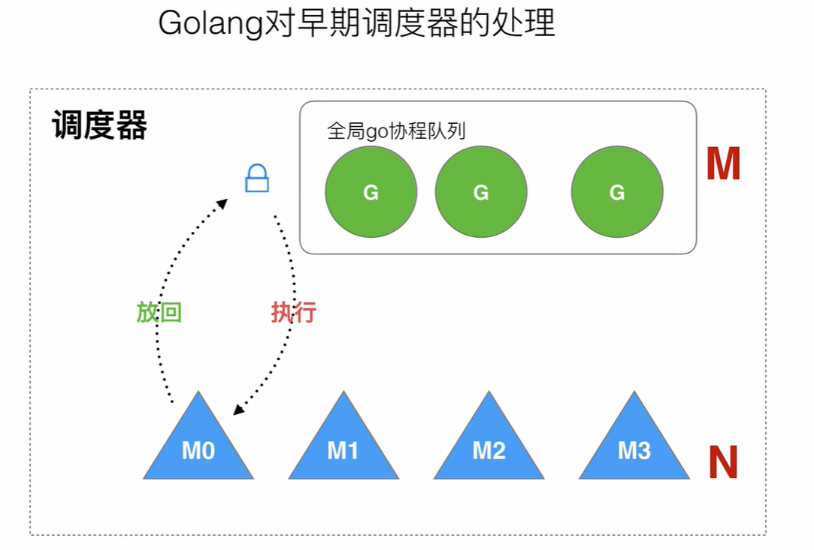

老调度器的缺点：

1. 创建，销毁，调度协程G都需要每个线程M去获取协程队列的锁，一旦加锁就会有同步互斥问题，形成了激烈竞争。
2. 线程操作或者转移协程就会造成系统延迟或额外负担，局部性降低。（比如M0在执行一个G的时候，这个G又创建了新的协程G',为了保证并发性，G'通常就会放到M1中继续执行，但我们希望相关性强的任务都在一个线程中，这样计算机切换的代价小，这就导致局部性很差。
3. 系统调用（cpu在M间的切换）,会导致频繁地线程阻塞和取消阻塞操作，这也增加了系统的不必要操作。

## GMP模型设计及图解

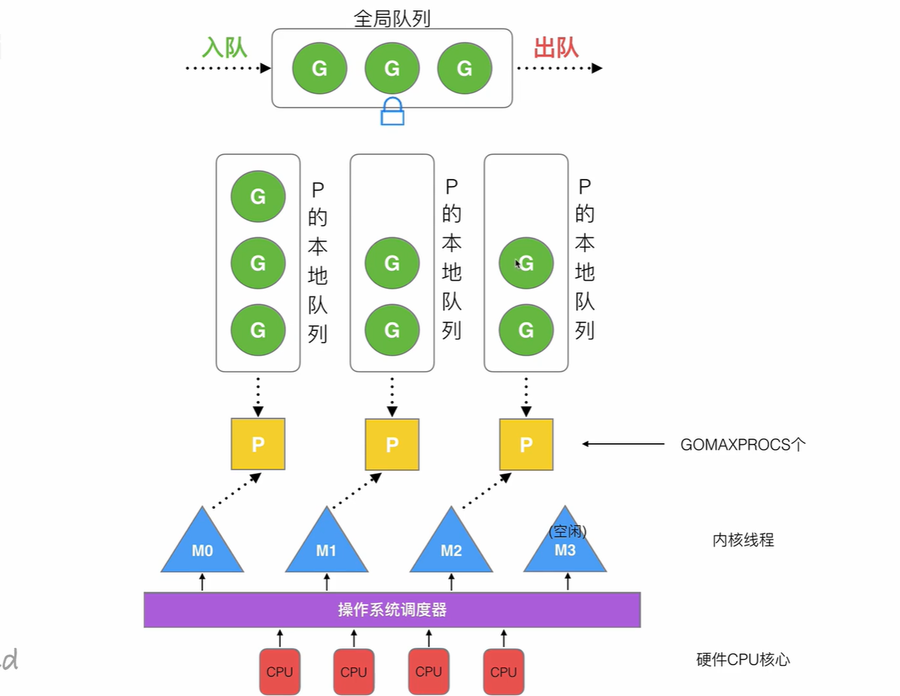

### go func()背后的过程

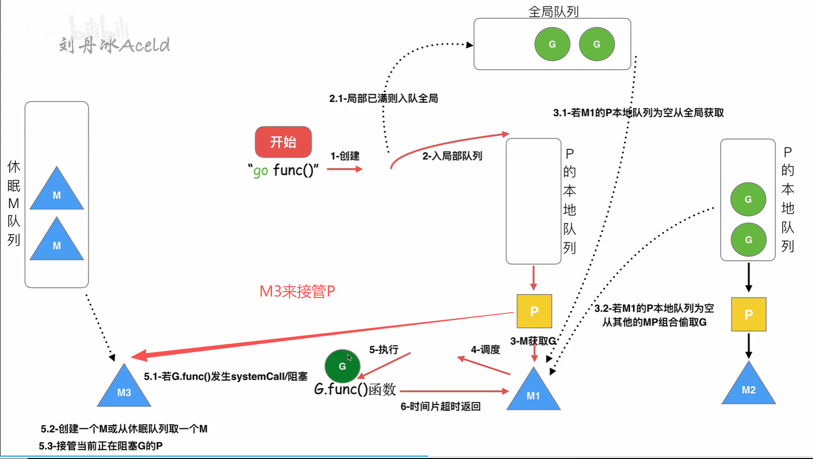

### go代码文件的执行流程

程序开始执行会创建第一个线程M0，M0会有自己的第一个协程0G0，G0来负责线程M0内所有的协程调度，线程M0要想调度其他协程，就需要先调度G0,

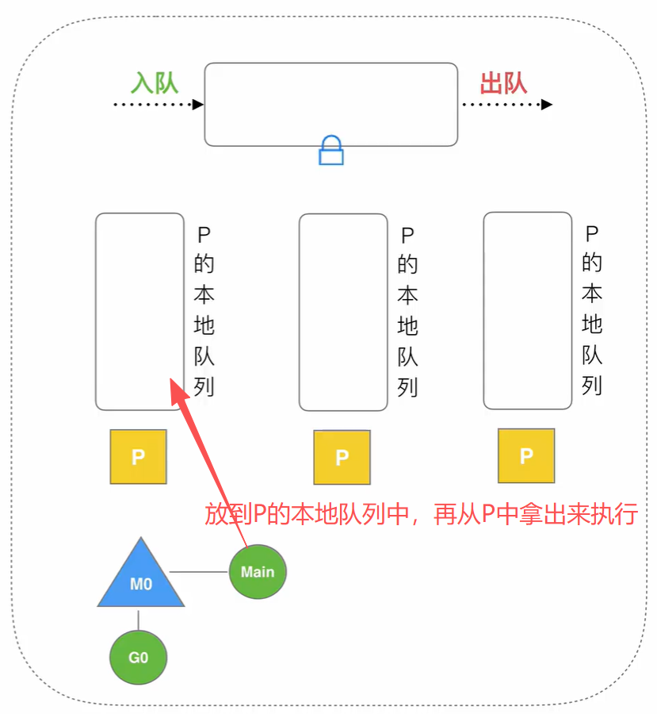

### trace可视化操作

#### 操作
[GMP浏览器调试](./b21.GMPmodel/trace/main.go)

#### 查看trace文件命令，在浏览器打开指定窗口
```bash
go tool trace GMPmodel/trace.out
```
#### 每个模块解读

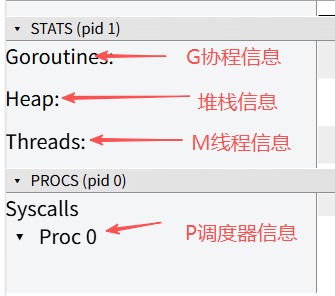

#### G的信息

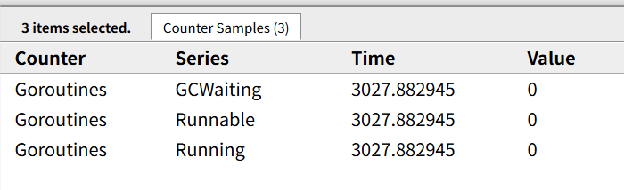

#### M的信息


#### P的信息

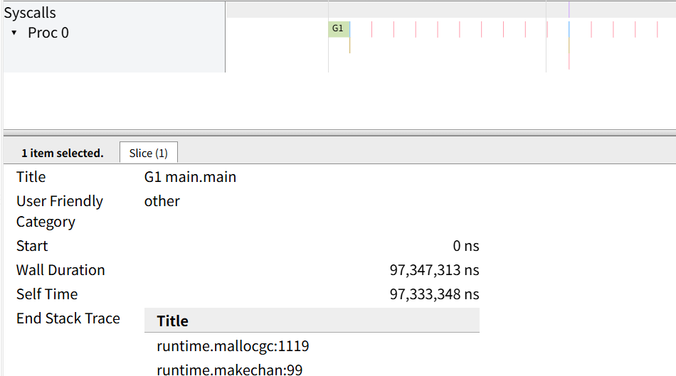

### 终端debug

```bash
set GODEBUG=schedtrace=1000
go build main.go
main.exe
```
就会出现打印信息
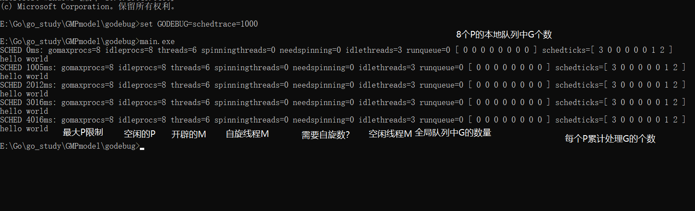

## GMP调度场景分析

### 一、G1创建新G3

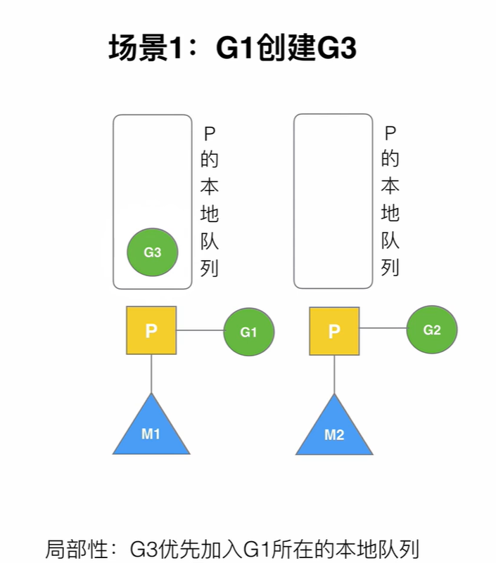

### 二、G1执行完毕

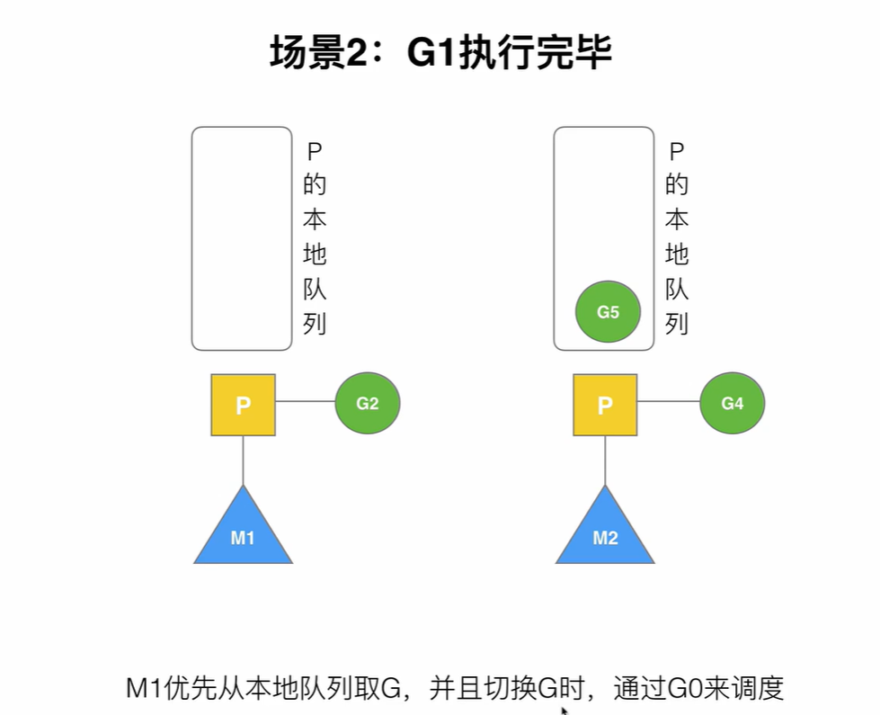

### 三四五、G2开辟过多G

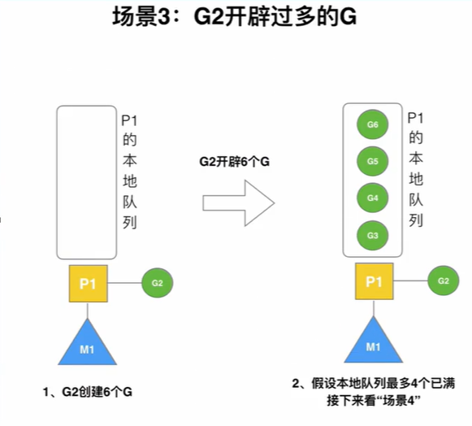

G2开辟过多G，导致P的本地队列满了，触发场景4

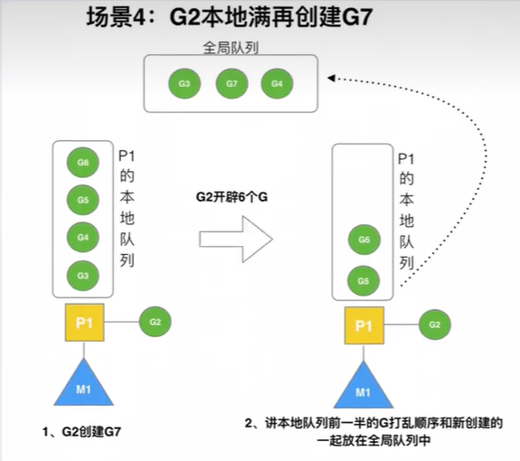

G2再创建G7放入本地队列时发现本地队列已经满了，会将当前本地队列的前一半的G打乱顺序和G7一起放到全局队列中，再创建G8触发场景五

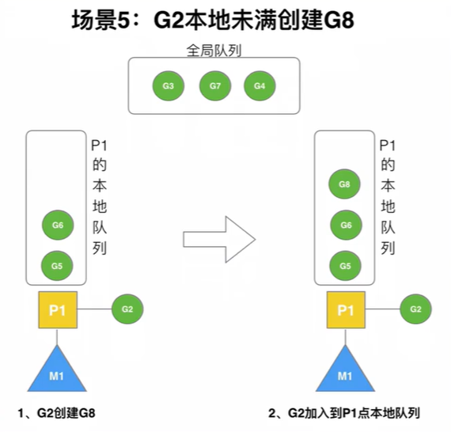

G2先把G8放到P的本地队列中，发现没满，可以放入

### 六、唤醒休眠的M

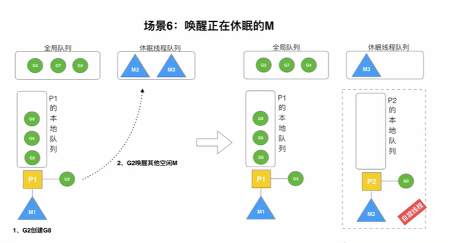

每当G2创建一个新的G时，就会尝试从休眠线程队列中去唤醒一个M2。

M2被唤醒后会寻找空闲的P绑定，若没有空闲的P,M2可能会再次会带休眠线程队列，若M2与P绑定成功，会创建自己的G0，如果M2绑定的P的本地队列没有G，此时M2进入自旋状态。

自旋状态的M2会不断的搜寻G来运行，先从全局队列中拿，全局队列中没有，就去其他P的本地队列去偷。

自旋线程时对cpu资源的一种浪费，但是如果不自旋，M2就会被销毁，反而浪费跟多的资源，所以就进行短期的自旋。

### 七、被唤醒的M2从全局队列获取批量G

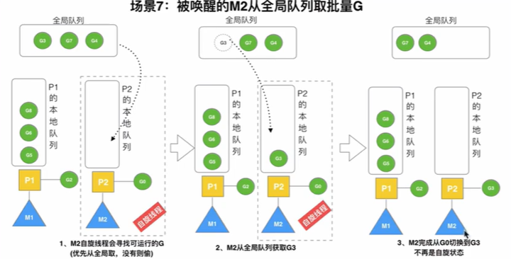

M2从全局队列中获取G的个数公式为 :

获取个数n=min( len(全局队列)/GOMAXPROCS+1 , len(全局队列)/2 )

也就是说一般取一半左右，取下来之后M2通过调度G0去执行，执行从全局队列中取出的G时，M2就不是自旋状态了

### 八、偷取G的情况

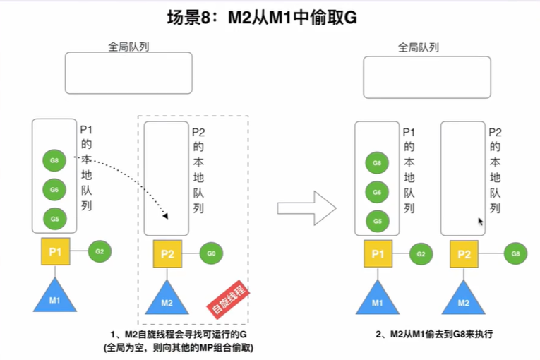

如果M2把从全局队列中取出的G都执行完了,P的本地队列为空了，就会再次挂起G0，进入自旋状态，再从全局队列中拿，如果全局队列也为空，就要进行偷取。

M2进行偷取时，会从想偷的MP绑定组合中P的本地队列内，取现有G数量的一半，偷取本地队列的后半部分，放到自己的本地队列中来执行。

### 九、自旋线程的最大限制

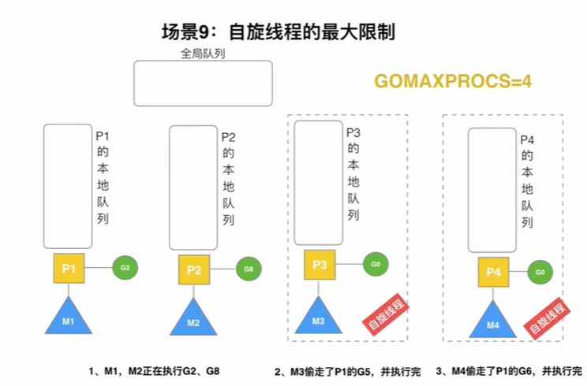

自旋线程并不能无限开辟，M必须要和P绑定，才能工作，因此限定P数量的GOMAXPROCS也限制了M的数量，要求：忙碌中的线程+自旋线程<=GOMAXPROCS。

如果唤醒了M,但P的数量已经达到上限，没有空闲的P，M就会再次回到休眠线程队列。

### 十、G发生系统调用/阻塞

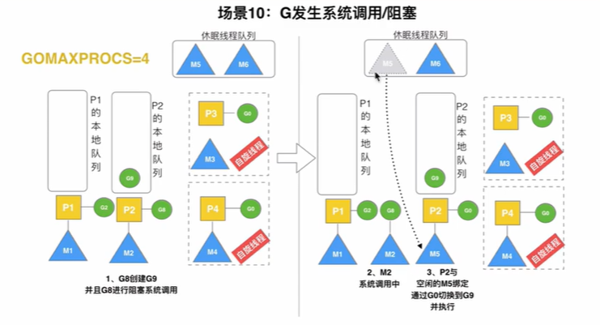

当M2和P2执行G8出现阻塞时，G8和会和M2进行绑定，M2让出cpu,等待阻塞完成来唤醒，为了不耽误后面G9的执行，同时P2与M2解绑，P2会从休眠线程队列中唤醒一个M进行绑定，从而继续执行G9。

P2不会去打扰自旋线程，自选线程已经有对应的P了，自旋线程寻求的是G。

之后M2若执行完了G8,触发场景十一。

### 十一、G发生非阻塞

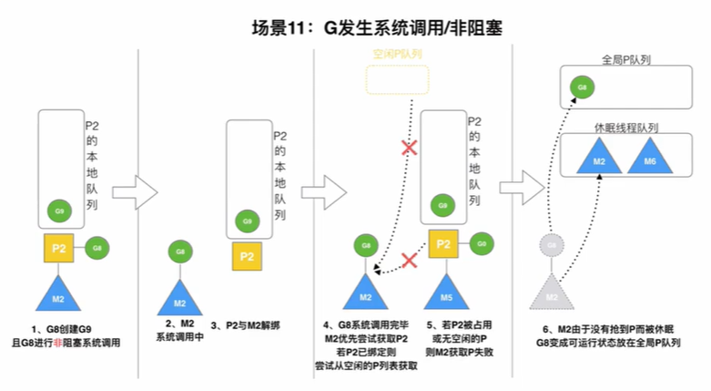

G8此时阻塞完了，此时M2想执行G8就需要一个P,M2会通过保存的信息会优先获取原配，也就是P2,若P2空闲，就回来和M2绑定继续处理G8，若此时P2已经和别人绑定，M2再取空闲P队列中获取一个P进行绑定，继续处理G8,若空闲队列也没有P了，那此时M2只能放弃G8，将G8放入全局队列中，M2自己进入休眠线程队列，G8和M2只能各自等待被处理或者唤醒。

进入休眠线程队列的休眠线程如果长期没有被唤醒，那么就会被当成垃圾被垃圾回收模块回收。


### 🔗 相关资源

- [Go官方文档](https://golang.org/doc/)
- [Go by Example](https://gobyexample.com/)
- [Go语言圣经](https://gopl-zh.github.io/)
