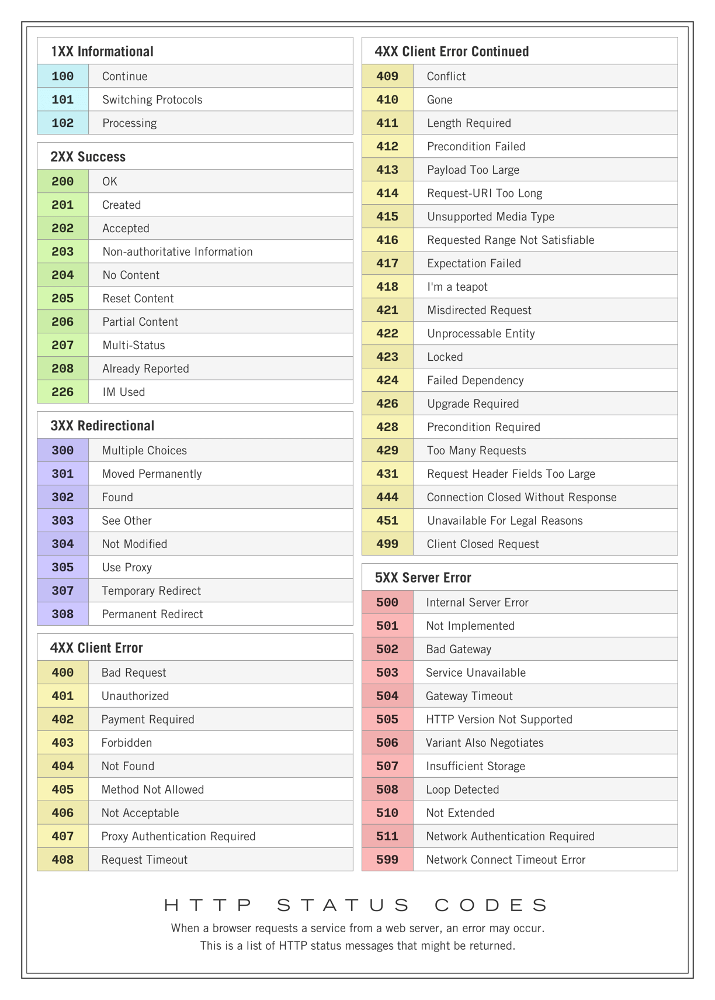

# Web 学习笔记

## 目录

- [Web 学习笔记](#web-学习笔记)
  - [目录](#目录)
  - [工具](#工具)
    - [Git](#git)
    - [MySQL](#mysql)
    - [Redis](#redis)
  - [RESTful API](#restful-api)
    - [RESTful 核心原则](#restful-核心原则)
    - [HTTP 状态码](#http-状态码)
    - [URL 设计](#url-设计)
  - [MVC模式](#mvc模式)
    - [项目目录结构](#项目目录结构)
  - [Go Web 框架](#go-web-框架)
    - [go原生http包的缺点](#go原生http包的缺点)
    - [gin](#gin)

---

## 工具

### Git
git是用来控制版本的
> 下载地址[git下载地址 ](https://git-scm.com/install/)
#### git文件忽略跟踪
在跟目录`.git`同级文件夹下新建`.gitignore`在该文件中配置要忽略的文件和文件夹
> eg：
```gitignore
# 文件夹名，也可以用路径名
.vscode
.obsidian
/docs/
```

### MySQL

1. 安装并配置环境变量
   - 官网地址: [dev.mysql.com/downloads](https://dev.mysql.com/downloads/mysql/)
   - 解压目录说明：
     - bin：存放 MySQL 可执行文件，如 mysql.exe、mysqld.exe
     - data：默认数据存储目录
     - my.ini：MySQL 配置文件
     - README：官方说明文档
   - 新建环境变量：
     1. 新建 MYSQL_HOME，指向 MySQL 安装根目录，例如 D:\environment\mysql-8.0.46-winx64
     2. 将 %MYSQL_HOME%\bin 加入到 PATH 中

2. 初始化数据库
   - 在 MySQL 安装目录中新建 my.ini 文件，内容如下：

```ini
[mysql]
default-character-set=utf8

[mysqld]
port = 3306
basedir=D:\environment\mysql-8.0.46-winx64
datadir=D:\environment\mysql-8.0.46-winx64\data
max_connections=200
character-set-server=utf8
default-storage-engine=INNODB
```

   - 使用管理员权限打开命令行，执行：

```bash
mysqld --initialize --console
```

   - 成功后，控制台最后一行会输出初始密码，记得保存。

3. 安装并启动 MySQL

```bash
mysqld install
net start mysql
```

4. 登录并修改密码

```bash
mysql -u root -p
```

输入刚才的初始密码后，执行：

```sql
ALTER USER 'root'@'localhost' IDENTIFIED WITH mysql_native_password BY '123456';
```

MySQL 安装完成 ✅

---

### Redis

- Redis 是常用的缓存与消息队列中间件。
- 通常用于：
  - 缓存热点数据
  - 会话存储
  - 限流与计数
  - 消息队列场景
- Windows 下可使用 Redis 官方版本或第三方稳定版安装包。
- 常用命令：

```bash
redis-server
redis-cli
```

---
### 接口测工具
Postman，Apifox
> 注意，接口能跑通的，前端页面不一定通，接口工具可以，前端不行
1. GET请求带请求体(body),
2. websocket带请求头

```

## RESTful API

> REST 是什么？

REST 是一种软件架构风格，用来规范前后端 API 接口的设计和调用方式。

### RESTful 核心原则

1. URI 设计规范
   - 使用名词代替动词表示资源
   - 使用复数形式命名集合
   - 使用小写字母和连字符 -
   - 避免在 URL 中出现文件扩展名

2. HTTP 方法的使用
   RESTful API 充分利用 HTTP 方法语义：

| HTTP 方法 | 描述                         | 多次调用结果相同 | 安全 | 特点                                 |
| --------- | ---------------------------- | ---------------- | ---- | ------------------------------------ |
| GET       | 获取资源（一个或多个）       | 是               | 是   | 可缓存，参数一般放在 URL             |
| POST      | 创建资源                     | 否               | 否   | 会改变服务器状态，参数一般放在请求体 |
| PUT       | 客户端提供完整资源数据       | 是               | 否   | 会替换整个资源，如果不存在则创建     |
| PATCH     | 客户端提供需要修改的资源数据 | 否               | 否   | 局部更新                             |
| DELETE    | 删除资源                     | 是               | 否   | 删除指定资源                         |

只要改变请求方法就能完成对应操作，语义清晰，易理解，易调用。

3. 无状态性
   每个请求必须包含处理所需的全部信息，服务器不保存客户端状态。这样更易于扩展和负载均衡。

4. 表述形式
   资源可以拥有多种表达形式，如 JSON、XML，客户端通过 Accept 头指定需要的格式。

### HTTP 状态码

| 状态码 | 含义                  | 说明           |
| ------ | --------------------- | -------------- |
| 200    | OK                    | 请求成功       |
| 201    | Created               | 资源创建成功   |
| 400    | Bad Request           | 请求有误       |
| 401    | Unauthorized          | 未授权         |
| 404    | Not Found             | 资源不存在     |
| 500    | Internal Server Error | 服务器内部错误 |

> HTTP 状态码速查图



### URL 设计

> 良好的设计 ✅

```http
GET /api/users          # 获取所有用户
GET /api/users/123      # 获取 ID 为 123 的用户
POST /api/users         # 创建新用户
PUT /api/users/123      # 更新用户 123
DELETE /api/users/123   # 删除用户 123
```

> 不好的设计 ❌

```http
GET /api/getUsers       # 动词出现在 URL 中
POST /api/createUser    # 动作导向而非资源导向
GET /api/user/delete/123 # 混乱的结构
```

说明：

- URL 中不要出现动词
- 接口应面向资源，而不是行为
- 结构应统一、语义清晰、易维护


---
## MVC模式
model-view-controler

### 项目目录结构

```
webdemo/
├── main.go                    # 程序入口文件
├── go.mod                    # Go 模块文件
├── go.sum                    # 依赖校验文件
├── config/                   # 配置文件目录
│   ├── database.go           # 数据库配置
│   └── config.go             # 应用配置
├── controllers/              # 控制器层
│   ├── user_controller.go   # 用户控制器
│   └── product_controller.go  # 产品控制器
├── models/                  # 模型层
│   ├── user.go              # 用户模型
│   ├── product.go           # 产品模型
│   └── database.go          # 数据库模型和连接
├── services/                # 业务逻辑层
│   ├── user_service.go      # 用户业务逻辑
│   └── product_service.go   # 产品业务逻辑
├── routes/                  # 路由配置
│   └── routes.go            # 路由定义
├── utils/                   # 工具函数
│   ├── validator.go         # 数据验证工具
│   └── response.go          # 响应工具
├── middleware/              # 中间件
│   ├── auth.go              # 认证中间件
│   └── cors.go              # 跨域中间件
├── views/                   # 视图层（可选）
│   ├── layouts/             # 布局模板
│   └── templates/           # 页面模板
└── static/                  # 静态文件
    ├── css/
    ├── js/
    └── images/
```


---
## Go Web 框架

### go原生http包的缺点
- 路由不明了，不区分请求方式，只分路径,还要在请求内部判断请求方法，get post
- 参数解析格式复杂
- 响应处理比较原始
### gin
[详见gin内README](README_gin.md)