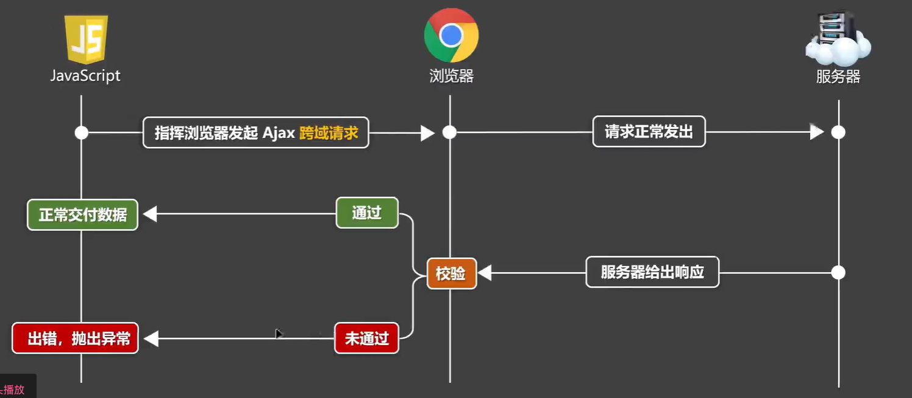
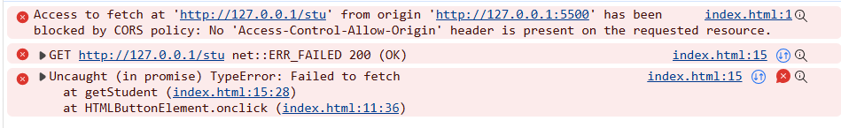

## 浏览器同源策略

### 什么是同源策略
同源策略（Same-Origin Policy）是浏览器的一个安全功能，它限制了不同源=域名+协议+端口）之间的资源访问。

### 同源的定义
两个页面具有相同的协议、域名和端口，三者都相同，它们就是同源的。
如果有一个不同，就是非同源，又叫跨域

## 非同源会有以下限制
1. DOM访问限制：源A的脚本(JavaScript对页面操作的代码)是不能读取到源B的DOM(document)的
   自己做的网站直接获取百度的document是被阻止的
2. cookie访问限制：源A不能读取到源B的cookie的
    想要cookie必须要有document，所以cookie更不可能
3. 源A可以给源B发请求，但A是获取不到B的响应数据的（Ajax限制，最大限制）
## 几个注意点
1. 跨域限制仅在浏览器端，服务端是不受跨域限制的。
2. 即使跨域，*Ajax请求也能正常发出*，但是**响应数据不会交给请求者**   


3. `<link>,<script>,`，这些标签发出的请求也可能会跨域，只不过浏览器对标签跨域不做严格限制，对开发无影响
### 常见的跨域场景
- 前端：http://localhost:3000
- 后端：http://localhost:8080

## 解决跨域的方法

### 1. CORS 
> *cors是解决跨域最正统的方式，且要求服务器是自己人*
(Cross-Origin Resource Sharing)跨域资源共享，控制浏览器校验跨域请求的一套规范，服务器需要依照这个规范添加特定响应头来控制浏览器校验，大致规则如下：
1. 服务器明确表示拒绝跨域，或不表示，浏览器校验不通过
2. 服务器明确表示允许跨域，浏览器校验通过
```go
// 设置响应头
// 
c.Header("Access-Control-Allow-Origin", "*")
c.Header("Access-Control-Allow-Methods", "GET, POST, PUT, DELETE, OPTIONS")
c.Header("Access-Control-Allow-Headers", "Content-Type, Authorization")
```
> 具体案例[go语言用cors解决跨域问题](../../gin/15.cors跨域问题/cors.go)
### 2. JSONP
适用于GET请求，通过<script>标签的src属性实现。

### 3. 代理
通过Nginx或其他代理服务器转发请求，避免浏览器直接跨域。